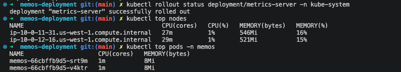

# End-to-End DevOps Deployment of Memos on Amazon EKS

A production-grade Kubernetes deployment demonstrating Terraform-based infrastructure provisioning, GitOps delivery with ArgoCD, automated CI/CD pipelines, AWS integrations, secret management, and full-stack observability with Prometheus, Grafana, and CloudWatch.

## Overview

This project deploys **Memos** — a self-hosted, open-source note-taking application — onto Amazon EKS using a complete DevOps workflow built from scratch.

Terraform provisions all AWS infrastructure and installs Kubernetes platform components via the Helm provider. Application deployments are managed through GitOps using ArgoCD, with the GitHub repository acting as the single source of truth. PostgreSQL persistence is provided by Amazon RDS, secrets are managed in AWS Secrets Manager, and observability is delivered through Prometheus, Grafana, and CloudWatch.

The project is structured as a six-stage learning journey, each stage building on the last — from local Docker development to production cloud infrastructure with automated CI/CD and comprehensive monitoring.


---

## Architecture


The architecture isolates public-facing infrastructure from private workloads. The Application Load Balancer sits in public subnets and routes traffic to EKS worker nodes in private subnets. The RDS PostgreSQL database is restricted to private subnets only. All outbound internet traffic from private subnets flows through NAT Gateways.

**Design decisions:**
- Public/private subnet separation — load balancer in public, workloads in private
- No direct internet access to worker nodes or database
- AWS Secrets Manager for all credentials, never stored in Git
- IRSA (IAM Roles for Service Accounts) for pod-level AWS access

---

## Tech Stack

| Category | Technology |
|----------|------------|
| Cloud | AWS (us-west-1) |
| Infrastructure as Code | Terraform |
| Container Orchestration | Kubernetes (Amazon EKS v1.31) |
| GitOps | ArgoCD |
| CI/CD | GitHub Actions |
| Container Registry | Amazon ECR |
| Database | Amazon RDS PostgreSQL 15.4 |
| Secrets Management | AWS Secrets Manager |
| Monitoring | Prometheus + Grafana + CloudWatch |
| Local Development | Docker + docker-compose |

---

## Features

- Modular Terraform infrastructure across VPC, EKS, RDS, and IAM
- Amazon EKS v1.31 cluster with managed node groups (autoscaling 1–4 nodes)
- Kubernetes Deployments, Services, ConfigMaps, Secrets, HPA, and PodDisruptionBudget
- Amazon RDS PostgreSQL with 7-day automated backups and enhanced monitoring
- Amazon ECR for private container image storage
- GitOps deployment with ArgoCD (auto-sync + self-heal)
- Automated CI/CD with GitHub Actions and OIDC (no long-lived keys)
- Prometheus metrics and Grafana dashboards for cluster and application observability
- CloudWatch dashboards, log groups, and alarms for AWS infrastructure monitoring
- CloudWatch Logs Insights for real-time EKS audit log querying
- Horizontal Pod Autoscaler for dynamic application scaling
- PodDisruptionBudget for availability during node operations
- Remote Terraform state in S3 with versioning and encryption

---

## Project Structure

```
memos-deployment/
│
├── README.md
│
├── app/
│   ├── Dockerfile
│   └── docker-compose.yaml
│
├── k8s/
│   ├── deployment.yaml
│   ├── service.yaml
│   ├── configmap.yaml
│   ├── secret.yaml
│   ├── hpa.yaml
│   ├── pdb.yaml
│   └── argocd-application.yaml
│
├── argocd/
│   ├── root-app.yaml
│   ├── argocd-project.yaml
│   └── apps/
│       ├── memos.yaml
│       ├── cloudwatch.yaml
│       └── monitoring.yaml
│
├── terraform/
│   ├── main.tf
│   ├── provider.tf
│   ├── variables.tf
│   ├── outputs.tf
│   ├── bootstrap/
│   └── modules/
│       ├── vpc/
│       ├── eks/
│       └── rds/
│
├── .github/
│   └── workflows/
│       └── deploy.yaml
│
└── docs/
    ├── STAGE1_BEGINNER_GUIDE.md
    ├── STAGE2_TERRAFORM.md
    ├── STAGE2_EKS_RDS.md
    ├── STAGE3_KUBERNETES.md
    ├── STAGE4_GITOPS.md
    ├── STAGE5_CICD.md
    └── STAGE6_MONITORING.md
```

---

## Deployment Workflow

---

## 1. Local Development (Stage 1)

The application runs locally using Docker Compose — PostgreSQL and the Memos service start together in under 15 seconds.

**docker-compose up** — both services starting, volumes created, containers healthy:


```bash
docker-compose -f app/docker-compose.yaml up -d
# Access: http://localhost:5230
```

---

## 2. Infrastructure Provisioning (Stage 2)

Terraform provisions all AWS resources across a bootstrap stack and a main infrastructure stack.

**Bootstrap stack** (run once):
- S3 bucket for remote Terraform state (versioned, encrypted)
- ECR repository for container images
- GitHub OIDC provider and IAM roles for CI/CD

**Main stack** (42 resources):
- VPC with public and private subnets across two Availability Zones
- Internet Gateway, NAT Gateways, and Route Tables
- Amazon EKS cluster v1.31 with managed node groups
- IAM Roles for cluster, node groups, and pod identity (IRSA)
- Amazon RDS PostgreSQL 15.4 in private subnets
- Security Groups with least-privilege rules
- AWS Secrets Manager for database credentials

**Terraform plan output** — 42 resources to add including VPC, EKS cluster, RDS, IAM roles, and all outputs:


```bash
# Bootstrap (once)
terraform -chdir=terraform/bootstrap init && apply

# Main infrastructure
terraform init && terraform plan && terraform apply
```

---

## 3. Kubernetes Deployment (Stage 3)

The Memos application is deployed to EKS using Kubernetes manifests.

The deployment includes:
- **Deployment** — 2 replicas with rolling update strategy
- **Service** — LoadBalancer exposing port 5230
- **ConfigMap** — application configuration
- **Secret** — database credentials (from Secrets Manager)
- **HorizontalPodAutoscaler** — scales pods based on CPU/memory
- **PodDisruptionBudget** — ensures availability during node operations
- **ServiceAccount** — with IRSA for AWS API access

**kubectl output** — `argocd app get memos` showing all 10 resources synced and healthy, pods running, and LoadBalancer service with external hostname:


```bash
aws eks update-kubeconfig --name memos-eks --region us-west-1
kubectl get pods -n memos
kubectl get svc -n memos
```

**Node and pod resource usage** — `kubectl top nodes` showing 2 nodes at 1% CPU and 15–16% memory, pods consuming 1m CPU and 8Mi memory each:



**EC2 Target Group** — both EKS worker nodes registered and healthy in the load balancer target group:


---

## 4. GitOps with ArgoCD (Stage 4)

ArgoCD manages all application deployments using Git as the single source of truth.

ArgoCD is configured to:
- Watch the GitHub repository on the `main` branch
- Automatically sync when changes are pushed
- Prune resources removed from Git
- Self-heal drift caused by manual `kubectl` commands
- Record full sync history with author and commit SHA

**ArgoCD Applications overview** — all 4 applications (cloudwatch, memos, root, secrets) Healthy and Synced to HEAD, each pointing to the `Ike-DevCloudIQ/memos-deployment` repository. Memos last synced 15 minutes ago:


**ArgoCD Application Details Tree** — memos application Healthy and Synced to HEAD (7fab048), showing ConfigMap, Namespace, Secret, Service, ServiceAccount, Deployment, HPA, and PodDisruptionBudget — all resources healthy, 2 pods running:


```bash
# View application status
argocd app get memos

# Sync manually if needed
argocd app sync memos
```

When a Git commit is pushed, ArgoCD detects the change and applies the updated manifests within minutes — no manual `kubectl apply` required.

---

## 5. CI/CD Pipeline (Stage 5)

GitHub Actions automates the full application delivery pipeline on every push to `main`.

**Pipeline steps:**
1. Configure AWS credentials via OIDC (temporary credentials, no stored keys)
2. Build Docker image
3. Authenticate with Amazon ECR
4. Tag image with short commit SHA and push to ECR
5. Update `k8s/deployment.yaml` with the new image tag
6. Commit and push the manifest change (`[skip ci]` prevents loop)
7. ArgoCD detects the Git change and synchronises the cluster

**Build & Push Docker Image job** — "Build and Deploy Memos #6" run showing all steps succeeding: Configure AWS Credentials (OIDC), Login to Amazon ECR, Set up Docker Buildx, Build and push Docker image (1m 37s):


**Update Kubernetes Manifests job** — updating the image tag in `deployment.yaml` and committing the manifest change back to Git in 7 seconds, triggering ArgoCD to sync:


**Key security practice:** GitHub Actions uses OIDC to assume an IAM role for temporary credentials scoped to the workflow. No AWS Access Keys are stored in GitHub Secrets.

```yaml
# OIDC authentication — no long-lived keys
- uses: aws-actions/configure-aws-credentials@v4
  with:
    role-to-assume: ${{ secrets.AWS_ROLE_ARN }}
    aws-region: us-west-1
```

---

## 6. Monitoring and Observability (Stage 6)

The project implements a full three-layer observability stack: Prometheus + Grafana for Kubernetes metrics, and CloudWatch for AWS infrastructure monitoring.

---

### Prometheus

Prometheus scrapes metrics from all namespaces every 15 seconds and stores 15 days of data.

**Prometheus Rule Health** — alertmanager rules, config-reloader rules, and etcd rules all evaluated every 30 seconds and returning OK:


---

### Grafana

Grafana provides dashboards for both cluster-wide and application-level metrics.

**Grafana — Kubernetes Compute Resources / Cluster** — real-time CPU and memory usage broken down by namespace (argocd, kube-system, memos, monitoring):


**Grafana — Memos Application Metrics** — application-level dashboard showing request rates, error rates, latency, and pod health specific to the Memos deployment:


---

### CloudWatch

CloudWatch provides AWS-native monitoring for infrastructure-level metrics and EKS control plane logs.

**CloudWatch Memos-Observability Dashboard** — showing EC2 CPU utilisation per node, load balancer healthy host count and request count, API server metrics, RDS free storage, and alarm status panel (memos-high-cpu, memos-high-errors, memos-high-memory):


**CloudWatch Logs Insights** — querying the EKS cluster audit log group, returning 46,131 events in 2.6 seconds from a 1-hour window. Shows real-time audit events with kind, apiVersion, stage, and requestURI fields:


```sql
SOURCE "arn:aws:logs:us-west-1:ACCOUNT:log-group:/aws/eks/memos-eks/cluster"
| fields @timestamp, @message
| sort @timestamp desc
| limit 50
```

---

## Security

- Worker nodes in private subnets — no direct public access
- Load balancer in public subnets — only entry point for application traffic
- RDS database in private subnets — no internet access
- IRSA (IAM Roles for Service Accounts) — pod-level AWS permissions, not node-level
- AWS Secrets Manager for database credentials — never stored in Git or Kubernetes manifests
- GitHub Actions OIDC — temporary AWS credentials, no long-lived access keys in GitHub
- Security groups with least-privilege rules per service
- S3 Terraform state with versioning, encryption, and access controls
- EKS control plane audit logging via CloudWatch

---

## Learning Outcomes

By following this project stage by stage, you will be able to:

- Build and optimise Docker images for production deployment
- Design multi-AZ AWS VPC architecture with proper security segmentation
- Provision and manage EKS clusters with Terraform
- Deploy applications to Kubernetes with health probes and autoscaling
- Implement GitOps with ArgoCD for declarative, auditable deployments
- Build CI/CD pipelines with OIDC authentication
- Set up Prometheus, Grafana, and CloudWatch for production observability
- Query EKS audit logs with CloudWatch Logs Insights
- Troubleshoot production issues using metrics, logs, and kubectl

---

## Stage Documentation

| Stage | Conceptual Guide | Quick Reference |
|-------|-----------------|-----------------|
| 1 — Docker | [docs/STAGE1_BEGINNER_GUIDE.md](docs/STAGE1_BEGINNER_GUIDE.md) | [STAGE1_QUICK_REFERENCE.md](STAGE1_QUICK_REFERENCE.md) |
| 2 — Terraform (VPC/EKS/RDS) | [docs/STAGE2_TERRAFORM.md](docs/STAGE2_TERRAFORM.md) + [docs/STAGE2_EKS_RDS.md](docs/STAGE2_EKS_RDS.md) | [STAGE2_QUICK_REFERENCE.md](STAGE2_QUICK_REFERENCE.md) + [STAGE2_EXTENDED_QUICK_REFERENCE.md](STAGE2_EXTENDED_QUICK_REFERENCE.md) |
| 3 — Kubernetes | [docs/STAGE3_KUBERNETES.md](docs/STAGE3_KUBERNETES.md) | [STAGE3_QUICK_REFERENCE.md](STAGE3_QUICK_REFERENCE.md) |
| 4 — GitOps | [docs/STAGE4_GITOPS.md](docs/STAGE4_GITOPS.md) | [STAGE4_QUICK_REFERENCE.md](STAGE4_QUICK_REFERENCE.md) |
| 5 — CI/CD | [docs/STAGE5_CICD.md](docs/STAGE5_CICD.md) | [STAGE5_QUICK_REFERENCE.md](STAGE5_QUICK_REFERENCE.md) |
| 6 — Monitoring | [docs/STAGE6_MONITORING.md](docs/STAGE6_MONITORING.md) | [STAGE6_EXECUTION_CHECKLIST.md](STAGE6_EXECUTION_CHECKLIST.md) |

---

## Future Improvements

- Integrate Loki for centralised log aggregation alongside Prometheus metrics
- Configure Alertmanager with Slack or PagerDuty notifications
- Add Velero for Kubernetes backup and disaster recovery
- Support multiple environments (staging, production) with ArgoCD ApplicationSets
- Add Trivy container image vulnerability scanning to the CI pipeline

---

## Author

**Ikenna Ubah**

[LinkedIn](https://www.linkedin.com/in/ikenna2/) | [GitHub](https://github.com/Ike-DevCloudIQ)

DevOps Engineer focused on AWS, Azure, Kubernetes, Terraform, GitOps, and CI/CD automation.
